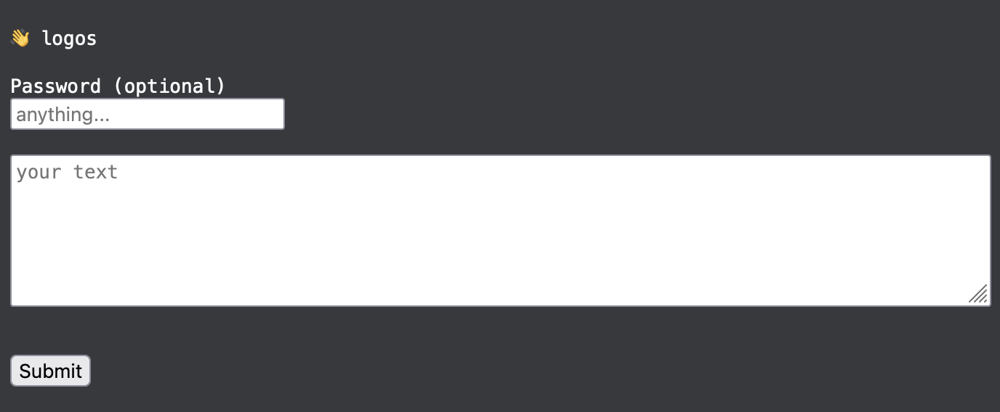

# logos

Simple "pastebin" for plain text data - accessible both from web & CLI.



## Usage

```shell
# Create new bin (returns URL)
curl -F file=@filename.txt http://localhost:3000

# optionally, set a password
curl -F file=@filename.txt http://localhost:3000 -F password=secret


# Read file from URL
curl http://localhost:3000/1
# optionally, provide a password
curl -F password=secret http://localhost:3000/1
```

Server returns a URL to the uploaded file and serves it in plain text (content type `text/plain`).

> Note: The server does not store the file name, so the URL is not related to the file name in any way.

> Data are stored up to 24 hours, then they are deleted automatically.

> Data are removed if too many requests with invalid password (10) are made too.

## Installation

### Build locally with Deno

```shell
git clone git@github.com:parallelo3301/logos.git
cd logos
deno task build

# you can customize the options in .env and run it
cp .env.defaults .env
nano .env
./logos

# or you may set the ENV variables directly like this
PORT=3000 PUBLIC_URL=https://logos.example.ltd MAX_FILE_SIZE_BYTES=50 DEFAULT_EXPIRATION_MINUTES=10 ./logos
```

### Docker (via Compose)

## Setup

1. Create `docker-compose.yml` file (and configure it as you wish):

```yaml
version: '3'

services:
  server:
    image: ghcr.io/parallelo3301/logos:latest
    restart: unless-stopped
    environment:
      - PORT=3000
      - PUBLIC_URL=http://localhost:3000
      - MAX_FILE_SIZE_BYTES=10000000
      - DEFAULT_EXPIRATION_MINUTES=1440
      - DB_FILE=/app/data/logosdb.sqlite
    ports:
      - 3000:3000
    volumes:
      - ./data/:/app/data/
```

2. Create `data` dir and empty `logosdb.sqlite` and `logosdb.sqlite-journal` files:

```bash
mkdir data
touch data/logosdb.sqlite
touch data/logosdb.sqlite-journal
```

3. Configure your reverse proxy (or add it to the `docker-compose.yml`) based on your needs.

4. Run the stack

```bash
docker compose up -d
```

5. You can access it at your `PUBLIC_SERVER_URL`, e.g. `http://localhost:3000`.

6. Profit

# Disclaimer

Yes, IDs are iterable (IDOR). There is no salt used for passwords. Data are not encrypted at rest.
